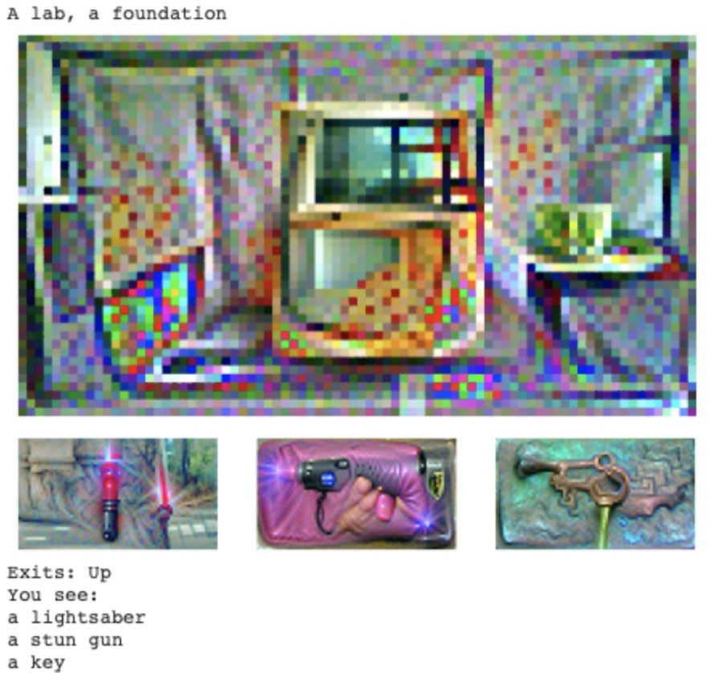

<h1 align="center">
  
</h1>

# My Game - Steins;Gate

## Game Description

This game named [*Steins;Gate*](https://store.steampowered.com/app/412830/STEINSGATE/), derived from [the famous anime with the same name](https://en.wikipedia.org/wiki/Steins;Gate_(TV_series)). It begins with a rag-tag band of tech-savvy young students who discover the methods of changing the past via mail, using a modified microwave. Later, you (Rintaro) and your teammates are involved into a seires of tasks and consequences, including 

1.   The death of Kurisu, your lover and the time machine theory founder
2.   The coming World War III triggered by the invention of time machine

In our game, we focus on the last part of the story. That is, you should travel back to a month ago to 

1.   Save your lover (Kurisu) by deceiving the world

2.   Destroy the time machine paper taken by Kurisu's father to avoid Word War III

Your different action will lead to different timeline! There're **4 timelines** waiting for you to explore!

## Why to Choose This Topic

Time travel is a funny and timeless sci-fi topic, and it can trigger different endings (both happy ending and bad ending) by differenct implemetation. It's quite challenging yet interesting to adapt the in-class interactive text game into a new time travel game.

## Demo

You can find the roadmap [here](my_game_visual.pdf). 

The game can generate [the images of location and item](./images) by the selected art style from [pixray](https://github.com/pixray/pixray).

### Demo 1 - Anime Style

<h1 align="center">
  
</h1>

### Demo 2 - Clipdraw Style

<h1 align="center">
  
</h1>

### Demo 3 - Pixel Style

<h1 align="center">
  
</h1>
